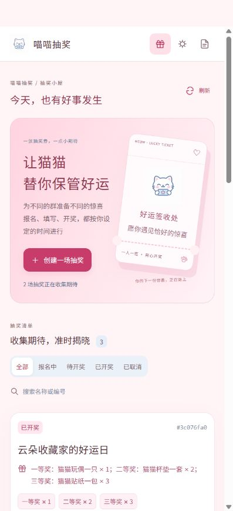
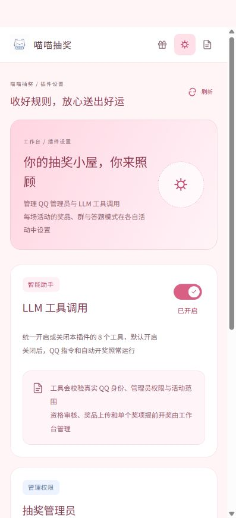
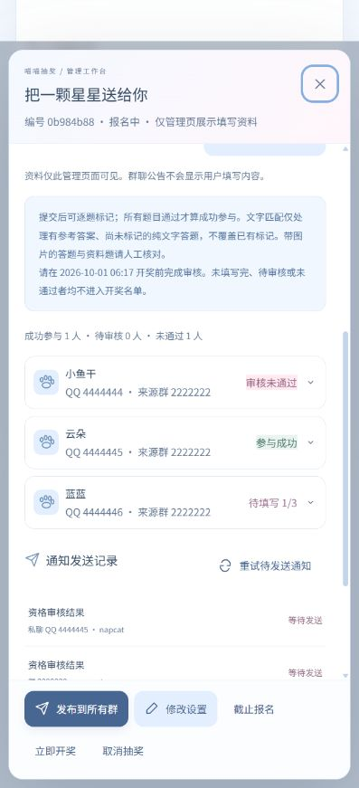

<div align="center">


# 喵喵抽奖

**把每一份期待收好，把每一份好运准时送达。**

QQ群聊报名 · 分级奖品与图片 · 私聊答题与资料 · 多平台多群 · 自动开奖

<p>
  <a href="https://github.com/WhiteCloudOL"></a>
  <a href="https://github.com/WhiteCloudOL/astrbot_plugin_catlottery"></a>
  <a href="LICENSE"></a>
</p>
<p>
  
  
</p>

[快速安装](#安装与打开管理页) · [创建抽奖](#创建第一场抽奖) · [参与流程](#参与者使用流程) · [指令列表](#指令列表) · [工具列表](#llm-工具列表) · [常见问题](#常见问题)

</div>

---

面向 QQ 群的 AstrBot 抽奖插件。每场抽奖独立设置机器人平台、参与群、报名资料、截止时间与开奖时间；从群聊报名，在私聊填写，到时间自动把开奖结果送到对应的群。

## 功能

- 支持 AstrBot 的 **AioCqhttp** 适配器，可接入 **NapCat、SnowLuma**；自动读取已开启的平台、在线机器人账号及其群列表。
- 每场抽奖拥有自己的平台与群列表，同一场活动的参与名单在这些群之间共享。同一 QQ 号跨群、跨平台只计一次。
- 支持一等奖、二等奖、三等奖及自定义奖项，各自设置奖品、中奖人数和图片；每场抽奖还可上传独立封面。每个 QQ 号在同一场活动中最多中奖一次。
- 管理员可在 WebUI 提前抽出某个奖项，剩余奖项继续按原时间开奖。已经揭晓的奖项、中奖者及其资格不会重新抽取或更改。
- 支持无资料直接报名，以及最多 20 项私聊问题：选择答题、文本答题、文本资料、图片资料、图文资料，可以混合设置并按顺序逐题填写。
- 每场抽奖可选择 **必须当场答对** 或 **先提交、后审核**。后审模式提交后直接进入下一题，管理员在 WebUI 标记资格，也可按预设文字答案匹配。
- 按实际 QQ 消息的发送者、机器人账号、平台和群验证身份。私聊不能发起报名，填写必须使用报名时的 QQ 号和机器人连接。
- 独立的粉色猫咪管理工作台，支持手机访问。「抽奖小屋」「插件设置」「使用指南」为侧栏切换的独立页面；选择器、图片上传、数量调节、日期时间、确认窗口等使用可复用的自定义组件。
- 指令帮助、报名、问题、错误提示、群公告、开奖通知均使用图片。图片由 Pillow 直接绘制，包含中文字体，无需浏览器渲染服务；较长内容自动分页。
- 支持独立的报名截止时间和自动开奖时间。重启后恢复活动及未发送通知；发送失败自动重试，中奖结果保持不变。
- 支持 QQ 指令与 8 个 LLM 工具，WebUI 可统一开启或关闭工具调用。管理员权限、平台范围和真实发送者校验由插件执行。
- 管理页可查看报名进度、私聊资料、逐题审核标记、中奖名单及群聊/私聊通知状态，也可重试通知或删除已结束的活动。

## 页面预览

<table>
  <tr>
    <td align="center"><strong>抽奖小屋</strong><br><br><a href="docs/images/webui.png"></a></td>
    <td align="center"><strong>插件设置</strong><br><br><a href="docs/images/settings.png"></a></td>
    <td align="center"><strong>使用指南</strong><br><br><a href="docs/images/guide.png"></a></td>
  </tr>
</table>

<p align="center"><sub>点击查看原图。电脑上使用侧栏，手机上使用顶部导航切换独立页面。主色为玫瑰粉，预览中的活动、账号与群号均为示例。</sub></p>

## 安装与打开管理页

1. 使用 **AstrBot 4.27.0 及以上版本**。本插件使用 AstrBot 内置的插件 Pages 与 Web API。
2. 在 AstrBot 中配置并开启 AioCqhttp 平台，让 NapCat 或 SnowLuma 连接成功，并将机器人加入要举办抽奖的 QQ 群。
3. 打开 AstrBot WebUI 的插件管理，通过仓库地址安装：

   ```text
   https://github.com/WhiteCloudOL/astrbot_plugin_catlottery
   ```

4. 在「喵喵抽奖」插件详情中打开 **「喵喵抽奖 · 管理工作台」**。管理页沿用 AstrBot 的登录身份，不需要独立端口或额外密码。
5. 在「插件设置」添加需要通过 QQ 管理活动的 QQ 号，并设置是否启用 LLM 工具调用。AstrBot 全局管理员始终拥有插件管理权限。

所有活动与插件设置都在这个管理页维护。本插件不提供 `_conf_schema.json`，不需要在 AstrBot 的通用插件配置表单中填写配置。依赖由 AstrBot 在安装插件时处理。

## 创建第一场抽奖

在工作台点击「创建一场抽奖」，依次填写：

| 设置 | 说明 |
| --- | --- |
| 抽奖标题 | 活动名称，最多 80 字。 |
| 活动封面 | 可选，单独上传一张图片，展示在小屋活动卡片、详情及群内公告和开奖结果中。 |
| 奖项列表 | 1–10 个奖项，例如一等奖、二等奖、三等奖。名称最多 30 字，不能重复，可添加、删除和向上调整顺序。 |
| 各奖项奖品 | 分别填写每位中奖者获得的奖品及领取说明，每项最多 300 字。 |
| 各奖项图片 | 每项可上传一张独立奖品图片，支持预览、更换和移除；展示在管理详情及群内图片通知中。 |
| 各奖项名额 | 每项 1–100 位，所有奖项合计最多 100 位。人数不足时优先满足列表靠前的未开奖奖项，剩余名额保留为空缺。 |
| 活动说明 | 可选，最多 1500 字。 |
| 报名截止时间 | 必须晚于当前时间；到时停止新报名、退出和资料填写。 |
| 自动开奖时间 | 等于或晚于报名截止时间，到时自动抽取并通知。 |
| 平台与群列表 | 至少添加一项，最多 50 项。每项选择一个平台的具体机器人账号及其群；可以添加多个平台和多个群。 |
| 私聊问题 | 可选，最多 20 项，按列表顺序填写。没有问题时，群聊参与即报名成功。 |
| 必须当场答对 | 每场独立的模式开关。开启时核对答题的文字答案，答错需重答；关闭时接受符合格式的答案并继续下一题，全部提交后等待管理员审核。新建活动默认关闭。 |

页面所有时间使用 **北京时间 UTC+8**，与浏览器和服务器所在时区无关。指令时间不带时区时也按北京时间解释；带时区的 ISO 8601 时间按其明确的时区处理。

创建后，活动立即接受符合范围的群报名。打开活动详情，点击「发布群公告」，将图片公告发到该活动列表中的全部群。管理页保存活动不会自动发布公告；QQ 指令或创建工具创建的活动会自动排队发布公告。

**参与范围按每场抽奖分别设置。** 在活动 A 中允许某个平台和群，不会让它自动获得活动 B 的操作权限。平台列表来自 AstrBot 已开启的 AioCqhttp 实例；未连接的账号不能作为新目标添加，已保存的目标离线后会保留，待连接恢复后继续投递。

已有报名或已经提前揭晓奖项后，平台、群、问题、答题模式、奖项顺序、奖品、奖品图片和各奖项名额会锁定，避免报名规则被中途更改。仍可编辑标题、活动封面、说明以及符合校验的未来时间。全部开奖或已取消的活动不能再编辑。

### 分级奖品与图片

点击「添加奖项」，为每一行填写奖项名称、奖品内容和名额，例如：

| 奖项 | 奖品 | 名额 |
| --- | --- | ---: |
| 一等奖 | 猫猫玩偶一只 | 1 |
| 二等奖 | 猫猫杯垫一套 | 2 |
| 三等奖 | 猫猫贴纸一包 | 3 |

每个奖项可以分别点击「上传图片」，也可将图片拖到对应上传区域。活动封面有单独的上传位置，与奖品图片互不影响。上传完成后点击「创建抽奖」或「保存修改」才会将图片关联到活动；图片尚在上传时不能保存。

封面与奖品图片支持 **JPG、PNG、WebP、GIF**，单张不超过 **8 MB、2400 万像素**。图片会按原始方向转为 JPEG，透明部分使用白色背景，最长边不超过 1600 像素，并去除原始元数据；GIF 保存第一帧。未绑定到活动的上传图片保留一天后清理。

正常开奖从上到下逐项分配，已中奖的 QQ 号立即从剩余名单中排除。上例中有 4 位成功参与者时，分配为一等奖 1 位、二等奖 2 位、三等奖 1 位，三等奖空缺 2 位；不会让某人重复中奖来填满名额。旧版本创建的单一奖品活动会按「幸运奖」显示，原规则与已有开奖结果保留。

### 提前开奖某个奖项

在活动详情的「奖项与开奖」找到目标奖项，点击 **「提前开奖」**，确认后只抽取该奖项，并向本场配置的全部群发送图片通知。

- 候选人是操作时已经成功参与、审核通过且尚未中奖的人。可以选择任意尚未开奖的奖项，包括先抽出三等奖。
- 本奖项的名单、开奖时间和候选名单摘要立即保存，不能再次抽取。人数不足时保留空缺；无人符合资格时仍保存空结果，不会在后续报名增多后补抽该奖项。
- 其余奖项继续按原截止、开奖时间运行。尚未中奖的用户可在截止前报名、填写或退出；后审活动可在计划开奖前继续审核尚未中奖者。
- 提前中奖者不能退出报名或更改审核资格，也不会再进入后续奖项的候选名单。
- 最后一个未开奖奖项被揭晓时，整场活动结束并锁定。已有奖项开奖后不能取消活动；可以截止报名或立即抽取全部剩余奖项。
- 「立即开奖」与 `/抽奖 开奖 编号 确认` 只抽出剩余奖项。到自动开奖时间后也只处理未开奖奖项，保留此前的结果。

## 私聊问题设置

| 问题类型 | 管理员设置 | 参与者发送 |
| --- | --- | --- |
| 选择答题 | 选择「答题」，填写问题和选项。选项最多 8 个；每行一项。正确答案填写完整选项文本；后审模式可留空供人工审核。 | 单个选项字母，例如 `A`；数字序号，例如 `1`；或完整选项文本，可附带一张图片。 |
| 文本答题 | 选择「答题」，不填写选项，可在正确答案中每行填写一个可接受答案。开启当场答对时必须填写参考答案。 | 发送文本答案，可在同一条消息中附带一张图片；图片随原始文字保存。 |
| 文本资料 | 选择「文本资料」，填写需要收集的内容说明。 | 发送 1–1000 字文本，可在同一条消息中附带一张图片。 |
| 图片资料 | 选择「图片资料」，说明要提交的图片。 | 发送一张图片，可在同一条消息中附带 1000 字以内的文字说明。 |
| 图文资料 | 选择「图文资料」，说明需要提交的文字和图片。 | 在同一条消息中发送 1–1000 字非空文字和一张图片，两者都必填。 |

每场活动最多 20 项问题，管理页点击「添加一个问题」可继续添加，并调整顺序。参与者一次只回答当前题，不需要把所有答案一次发完。**后审模式**提交符合格式的答案即显示下一题，不当场判断对错；**当场答对模式**答错留在当前题，答对后继续。空白文字、缺少必填图片、多图或超限文件等格式错误，在两种模式下都会提示重新提交。

每个问题的描述最多 300 字。答题支持最多 20 个可接受答案，命中其中任意一个即可通过文字匹配。当场判题或后续文字匹配时，忽略首尾空白、英文大小写和常见全角/半角差异，保留词语之间的空格差异；例如 `a b` 与 `a  b` 不会混为同一个答案。

**原始文字完整保存，包括首尾空格、连续空格与换行，不会按空格拆成多个答案。** 管理页同时展示文字和图片下载入口。每题最多附带一张图片，文字最多 1000 字，空格和换行也计入长度。图片不会代替文本答题的文字答案，也不会被用于自动判题。

图片限制为 **8 MB、2400 万像素以内**。插件读取图片后转存为去除原始元数据的 JPEG，最长边缩小到 2000 像素。GIF 保留一帧。不能读取的文件、多图、超限图片均会提示重新提交，并保留原有填写进度。

所有设置的问题均为必填。资料与正确答案不会出现在群公告、开奖通知或公开查询中，已登录的管理页可以查看报名资料。

### 两种模式与资格审核

| 模式 | 作答流程 | 何时成功参与 |
| --- | --- | --- |
| 必须当场答对：开启 | 答题按预设文字答案核对；答错重新回答当前题。文本、图片和图文资料检查是否符合提交格式。 | 在报名截止前答对所有答题，并填完全部资料。 |
| 必须当场答对：关闭 | 不现场判定对错，提交符合格式的答案后直接显示下一题。全部提交后显示「等待审核」。 | 管理员在开奖前将所有题目标记为「正确 / 符合要求」，才获得开奖资格。 |

后审活动在详情页管理资格：

1. 打开活动详情，展开对应 QQ 的「报名与私聊资料」。先核对 QQ、来源群及提交内容。
2. 每题使用自定义审核选择器，标记 **待审核**、**正确 / 符合要求** 或 **错误 / 不符合要求**。文本、图片及图文资料均可人工标记；审核会保存操作人和时间。
3. 有预设文字答案时，可点击 **「按文字答案匹配」**。它只处理有参考答案且尚未标记的**纯文字答题**，支持选项字母、序号或完整选项文本；已有人工或匹配标记不会被覆盖。含图片的答题、图片资料、文本资料及图文资料由人工核对。
4. 全部题目通过后，报名改为「参与成功」，群聊与私聊分别发送成功图片。任一题不符合要求则无开奖资格；管理员可在开奖前更正或重置标记。

**报名截止后仍可审核已提交的资料，但必须在开奖时间前完成。** 到达开奖时间或手动立即开奖后，资格与结果锁定，不能追加审核或重新抽奖。请为后审活动预留足够的截止至开奖间隔；仅点击文字匹配不一定完成整份资料的审核。

没有问题时，两种模式均直接成功参与。此前已创建的活动沿用当场答对模式，不改变原报名规则。

<p align="center"><a href="docs/images/review.png"></a><br><sub>窄屏审核页示例：资格状态与填写进度分别显示。</sub></p>

## 参与者使用流程

在允许的群内发送：

```text
/抽奖 列表
/抽奖 详情 a1b2c3d4
/抽奖 参与 a1b2c3d4
```

`a1b2c3d4` 是编号示例，请使用活动公告或列表中的实际编号。

**没有私聊问题：** 报名直接成功，插件分别向报名所在的群和参与者私聊发送成功图片。

**有私聊问题：** 群内先收到「已预留报名」图片，尚未完成报名。插件查询报名机器人的好友列表：已经是好友时，直接提示私聊填写；不是好友时，提醒先添加该机器人。好友查询失败时，会说明暂时无法确认，不会把未知状态当作未添加好友。

按群内图片提示私聊同一个机器人：

```text
/抽奖 填写 a1b2c3d4
```

随后按当前题要求，逐条发送答案、文本资料、图片或图文消息。当场答对模式全部完成后，**报名所在的群和参与者私聊都会收到成功图片**。后审模式全部提交后，两处先收到「资料已提交 · 等待审核」图片，审核通过再分别收到成功图片；未通过也会通知当前资格。私聊发送失败时，群通知仍可正常发送，私聊通知保留在队列中自动重试；报名与资格状态不受通知失败影响。

同一机器人上同时有多场待填写活动时，用 `/抽奖 待办` 查看，再用 `/抽奖 填写 编号` 选择本次要填写的表单。暂停使用 `/抽奖 取消填写`，已保存的答案会保留。也可以用 `/抽奖 回答 内容` 提交当前题的文字，并在同一条消息中附带图片；特别适合以 `/` 开头的内容，例如 `/抽奖 回答 /docs/guide`。`回答` 后的第一个空白字符用作指令分隔符，其余内容原样作为答案。

请在群中发起参与，**私聊不能创建新的报名记录**。机器人不会代替参与者接受好友申请，也不会替参与者填写资料。

## 指令列表

所有指令的插件回复均为图片。指令是否需要 `/` 前缀由 AstrBot 的唤醒配置决定；下表采用默认示例。

| 指令 | 使用位置 | 作用 |
| --- | --- | --- |
| `/抽奖` 或 `/抽奖 帮助` | 群聊、私聊 | 图片帮助。 |
| `/抽奖 列表` | 群聊、私聊 | 最近 20 场允许当前机器人/群查看的活动。 |
| `/抽奖 详情 编号` | 活动允许的群、机器人私聊 | 查看规则、时间和已保存的中奖名单。 |
| `/抽奖 参与 编号` | 活动允许的群 | 为实际发送者报名；有问题时预留记录并引导私聊。 |
| `/抽奖 状态 编号` | 活动允许的群、机器人私聊 | 查看发送者自己的填写进度、待审核/未通过或成功参与状态。 |
| `/抽奖 退出 编号` | 活动允许的群 | 截止前移除发送者自己的报名和已提交资料。 |
| `/抽奖 填写 编号` | 报名时的机器人私聊 | 选择已有的群报名，继续填写下一题。 |
| `/抽奖 待办` | 私聊 | 查看这个机器人上尚可填写的活动。 |
| `/抽奖 取消填写` | 私聊 | 暂停当前表单，保留资料。 |
| `/抽奖 回答 内容` | 私聊 | 提交当前题的完整文字，可附带一张图片；保留空格和换行。后审模式提交后直接下一题，当场答对模式答对后继续。 |
| `/抽奖 创建 标题 \| 奖品 \| 人数 \| 截止时间 \| 开奖时间` | 管理员所在的目标群 | 快速创建当前平台、当前群的单一奖品、无资料抽奖并发布公告；分级奖项、图片与封面使用 WebUI 配置。 |
| `/抽奖 发布 编号` | 管理员，活动允许的群或机器人私聊 | 将活动公告发到全部配置群。 |
| `/抽奖 截止 编号 确认` | 同上 | 立即停止报名和填写，保留原定自动开奖时间。 |
| `/抽奖 开奖 编号 确认` | 同上 | 立即截止并抽取全部剩余奖项，保存最终名单。 |
| `/抽奖 取消 编号 确认` | 同上 | 取消尚未揭晓任何奖项的活动，并向对应的群发送取消通知。 |

快速创建示例：

```text
/抽奖 创建 午后好运 | 猫猫贴纸一套 | 2 | 2026-10-01 20:00 | 2026-10-01 20:10
```

请将示例日期改为未来时间。多平台、多群或带私聊问题的活动建议在管理工作台创建。

## LLM 工具列表

在工作台的「插件设置」中，通过 **「LLM 工具调用」开关**统一管理这 8 个工具，默认开启，点击「保存设置」后生效并在重启后保留。关闭后，工具不再向 LLM 开放，尚未执行的旧工具调用也会被拒绝；**QQ 指令、私聊填写、定时开奖和通知重试继续正常使用**。

在 AstrBot 启用对应工具后，可以用自然语言查询、报名和管理活动。工具描述明确规定使用场景、参数来源、群聊/私聊限制及管理员权限；服务端始终使用实际消息发送者的 QQ 身份，不接受 LLM 指定他人的 QQ 号。

| 工具名 | 参数 | 作用与限制 |
| --- | --- | --- |
| `catlottery_list` | 无 | 只读查询当前平台、机器人和群允许的活动，返回真实编号，不发起报名。 |
| `catlottery_info` | `lottery_id` | 查看指定活动的公共规则并发送图片；不会参加抽奖。 |
| `catlottery_join` | `lottery_id` | 仅在用户明确要求参加时，为群消息实际发送者报名；私聊禁止调用参与。 |
| `catlottery_status` | `lottery_id` | 查看实际发送者自己的填写状态、审核状态及是否有开奖资格；待审核不代表成功参与。 |
| `catlottery_withdraw` | `lottery_id` | 在用户明确要求退出时，从允许的群中撤回自己的报名。 |
| `catlottery_fill` | `lottery_id` | 仅在原机器人私聊中选择已由群报名产生的待填写记录，发送下一题图片。不会代替用户作答。 |
| `catlottery_create` | `title`、`prize`、`winner_count`、`close_at`、`draw_at` | 管理员在实际目标群内创建单一奖品、无资料抽奖。必须提供全部值；人数为 1–100 的整数；缺失时应追问，不可猜测奖品或时间。分级奖项、封面与奖品图片使用 WebUI。 |
| `catlottery_manage` | `lottery_id`、`action`、`confirmed` | 管理员管理指定活动；`action` 仅支持 `publish`、`close`、`draw`、`cancel`。`draw` 抽取全部剩余奖项，单个奖项提前开奖使用 WebUI；已有奖项开奖后不能 `cancel`。只有用户明确要求对该活动执行该操作时才能传 `confirmed=true`。 |

“看看开奖结果”应调用查询工具；“立即开奖”才使用 `draw`。“退出我的报名”使用 `catlottery_withdraw`。工具不会因提及、引用或昵称更改实际操作对象。

## 截止、开奖与通知

- 截止时间一到，即使定时任务还未运行，也会在报名及提交资料时拒绝过期请求。未完成资料的预留报名不会参与开奖。
- 自动开奖通常在设定时间后的一个检查周期内开始，检查周期为 5 秒；QQ 实际收到通知还取决于协议端和网络。
- 开奖只从**成功参与且资格通过**的报名中随机选出不同 QQ 号。未填写完、待审核、审核未通过者不会进入候选名单。每个 QQ 号最多获得一个奖项；各奖项的名单、开奖时间、候选人数及名单摘要一起保存。已开奖奖项不能再次开奖。
- 没有合格参与者时，仍正常完成开奖，保存有效人数为 0、中奖名单为空的最终结果，并向该活动全部配置群发送「无人符合开奖资格，本次无人中奖」图片。不重新抽取、不把预留报名或待审核者补入名单。
- 开奖图片发送到该活动配置的全部平台和群。每个目标使用对应机器人账号投递。
- AstrBot 停止运行时无法发送消息。恢复运行后会补开已到期且未开奖的活动，并继续发送积压通知。
- 失败通知从 30 秒开始逐步延长重试间隔，最长 1 小时。活动详情中显示最近 200 条通知记录；「重试待发送通知」只重试尚未成功的通知，不重新抽奖。
- 协议端在已送达后超时、或进程在发送成功后立即退出时，重试可能产生重复通知；保存的报名和中奖结果始终只有一份。

## 权限、资料与日志

WebUI 管理权沿用 AstrBot 登录权限。QQ 管理操作仅允许 AstrBot 全局管理员，以及本插件工作台「插件设置」中的 QQ 号；普通群成员可以查询和管理自己的报名。QQ 管理指令与工具也受该活动的平台、机器人和群列表约束。

运行数据保存在 AstrBot 数据目录中的：

```text
data/plugin_data/astrbot_plugin_catlottery/
├── lotteries.sqlite3
├── uploads/                  （私聊报名图片）
└── artwork/                  （活动封面与奖品图片）
```

插件更新不会覆盖这个目录。备份时先停止 AstrBot，再复制整个目录；如有 SQLite 的 `-wal`、`-shm` 文件，请一并保留。参与者截止前退出报名时，会删除该报名的图片；提前中奖者不能退出。管理员可以在活动全部开奖或取消后，通过管理页删除活动及其资料；其他活动或已保存通知仍引用的封面、奖品图片会保留。取消活动本身会保留记录，便于查看。

插件使用 AstrBot 日志系统，包含 `DEBUG`（填写进度、重复请求）、`INFO`（生命周期和管理操作）、`WARNING`（权限拒绝、平台离线、发送失败）、`ERROR`（存储和后台任务异常）级别。排查通知问题时，先查看活动详情中的投递记录，再查看 AstrBot 日志。插件不记录私聊答案、图片内容或登录令牌。

## 常见问题

**管理页没有平台或群。** 检查 AstrBot 是否开启了 AioCqhttp 实例，协议端是否已连接、机器人是否已入群，然后点击刷新平台列表。其他平台适配器不会出现在可选列表中。

**QQ 指令没有响应。** 检查插件是否启用、AstrBot 的唤醒前缀是否包含 `/`，以及平台是否使用 AioCqhttp。QQ 指令不会绕过 AstrBot 本身的黑白名单和消息过滤规则。

**已预留报名或已提交资料但没有进入开奖。** 预留、提交与成功参与是不同状态。请在截止前私聊原机器人完成全部问题，再用 `/抽奖 状态 编号` 确认；后审活动还需管理员在开奖前审核全部通过。

**添加好友后仍未收到私聊消息。** 检查机器人账号是否接受好友申请、协议端是否允许发送私聊、账号是否被限制。管理页可以查看失败通知并安排重试。

**同一活动换群、换机器人再次参加。** 不会新增机会。已有待填写记录会引导回到最初报名的机器人；更换自己的昵称不会改变报名身份。

**开奖时间已到但群没有消息。** 查看活动是否已经开奖，再查看通知是否等待重试。确认对应平台、机器人账号和群可用即可；不要重新创建活动或反复立即开奖。

## 许可证与资源

插件代码采用 [GNU Affero General Public License v3.0](LICENSE)。使用、修改和再分发请遵循该许可证。

随附的 Noto Sans SC 中文字体采用 SIL Open Font License 1.1，许可证见 [FONT-LICENSE.txt](pages/manage/assets/FONT-LICENSE.txt)。猫咪图标与消息卡片图形随插件源码提供。
