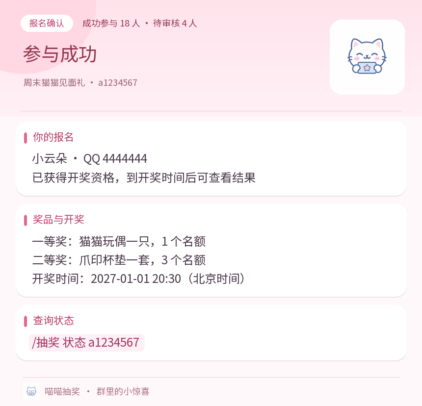
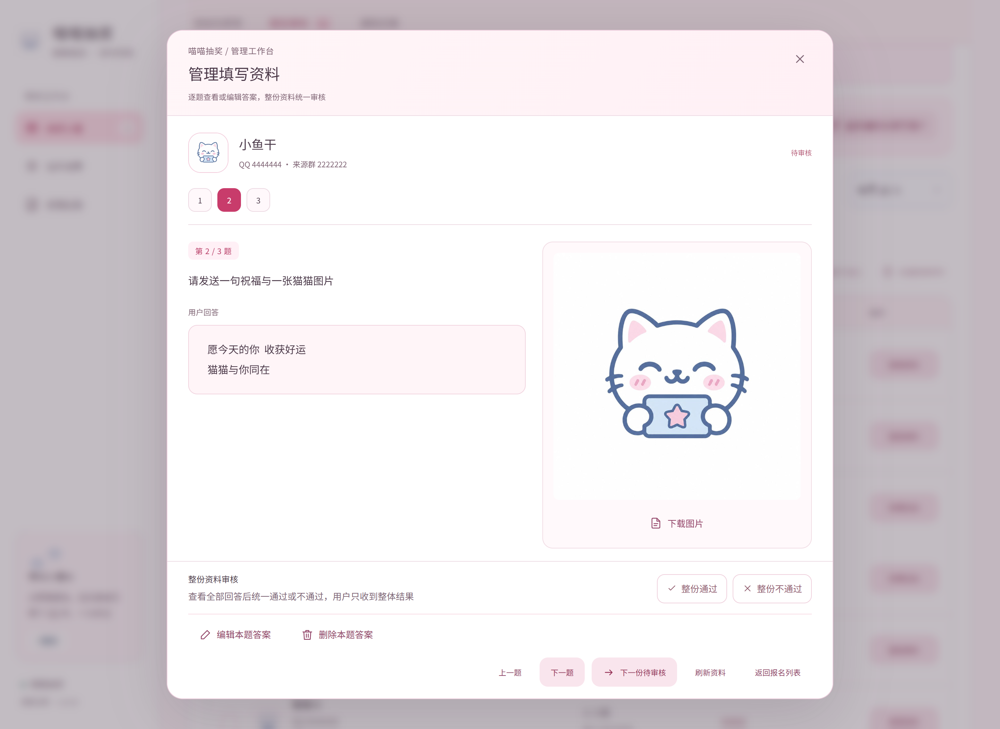
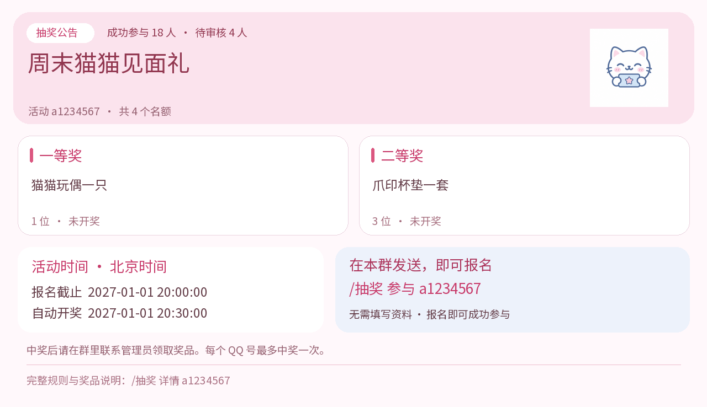

<div align="center">


# 喵喵抽奖

QQ群报名、私聊填资料，到点自动开奖。

支持多奖项、资格审核、定时群公告，也可以提前抽出某个奖项。

[安装](#安装与打开管理页) · [创建抽奖](#创建一场抽奖) · [参加抽奖](#参加抽奖) · [指令](#指令速查) · [常见问题](#常见问题)

</div>

## 安装与打开管理页

需要 **AstrBot 4.27.0 或以上版本**，使用 **AioCqhttp** 平台连接 QQ。可搭配 NapCat、SnowLuma；其他消息平台暂不支持。

1. 在 AstrBot 中开启 AioCqhttp 平台，确认 QQ 已连接，并让机器人加入活动群。
2. 在插件管理中，通过以下仓库地址安装「喵喵抽奖」：

   ```text
   https://github.com/WhiteCloudOL/astrbot_plugin_catlottery
   ```

3. 打开插件详情中的 **「喵喵抽奖 · 管理工作台」**。管理页使用 AstrBot 的登录身份，无需设置单独的密码或端口。
4. 如需让其他人通过 QQ 管理抽奖，在「插件设置」中添加管理员 QQ 号。AstrBot 全局管理员无需重复添加。

活动、问题和通知都在插件管理页设置，不需要填写通用插件配置表单。

<p align="center"><a href="docs/images/webui.png"></a></p>

## 创建一场抽奖

点击 **「创建一场抽奖」**，依次填写：

| 设置 | 怎么填 |
| --- | --- |
| 标题与说明 | 标题最多 80 字，说明最多 1500 字。可写领奖方式和活动要求。 |
| 封面 | 可选。封面独立于奖品图片，显示在活动列表、详情和群通知中。 |
| 奖项 | 设置 1–10 项，每项填写名称、奖品和名额，可分别上传图片。奖项名称最多 30 字，奖品说明最多 300 字。 |
| 名额 | 每项 1–100 人，合计最多 100 人。每个 QQ 号在同一活动中最多中奖一次。 |
| 截止与开奖 | 设置报名截止时间和自动开奖时间；开奖不能早于截止。需要审核时，请在两者之间留出审核时间。 |
| 平台与群 | 至少选择一个机器人账号和群，最多 50 个目标。可同时选择多个平台、账号和群。 |
| 通知 | 设置群聊回执是否发送，以及是否定时或循环发布群公告。 |
| 私聊问题 | 可选，最多 20 项。不添加问题时，群内报名即成功参与。 |

**所有时间均按北京时间（UTC+8）显示。** 指令中不带时区的时间也按北京时间解释；带时区的 ISO 时间按其指定时区处理。

保存后活动开始接受报名。进入活动详情，点击 **「发布群公告」**，机器人会向所选群发送公告图片，再单独发送一条可复制的参与指令。管理页保存活动不会自动发公告。

图片支持 JPG、PNG、WebP、GIF，单张不超过 **8 MB、2400 万像素**。GIF 仅保留第一帧，透明背景转为白色。封面和奖品图片最长边压缩至 1600 像素；上传后还需保存活动才能生效。

### 多群活动的规则

- 同一场活动在所选群之间共享报名名单，同一 QQ 号跨群、跨平台只计一次。
- 参与者必须在允许的群内报名，私聊不能发起报名。
- 私聊资料需使用报名时的 QQ 号，发给报名时的机器人，并通过原平台连接填写。
- 每场活动的参与范围独立。加入活动 A 的群，不会自动获得活动 B 的参与权限。

### 哪些设置可以修改

已有报名或已有奖项开奖后，平台、群、问题、答题模式、奖项顺序、奖品、奖品图片和名额都会锁定。

标题、封面、说明和通知设置仍可修改。报名截止后，可以保留原截止时间来修改通知等设置，无需延长报名；如需重新开放报名，需明确将截止时间改到未来。开奖时间到达后、全部奖项已开奖或活动已取消时，不能再修改活动。

修改参与群会撤销尚未发送的旧招募公告，请按新范围重新发布。

## 参加抽奖

在活动群中发送：

```text
/抽奖 列表
/抽奖 详情 a1b2c3d4
/抽奖 参与 a1b2c3d4
```

`a1b2c3d4` 只是示例，请替换为公告里的实际编号。

**无需填写资料的活动：** 群内报名后即参与成功，机器人发送私聊确认；活动开启群聊成功通知时，也会在报名群发送确认。

**需要填写资料的活动：** 群内先提示「已预留报名」，机器人再私聊发题。请逐题直接回复。尚未加好友时，先添加该机器人；没收到题目或暂停后想继续，可以私聊发送：

```text
/抽奖 继续
```

多场活动都有待填写资料时，发送 `/抽奖 待办` 查看，再用 `/抽奖 切换 编号` 选择活动。

作答模式会优先接收本场私聊答案，并终止后续普通聊天与消息合并处理；未进入、暂停或到期后恢复正常聊天。

进入或恢复作答模式后，可在 **30 分钟内直接回复文本、图片或引用题目回复**，无需命令前缀。引用内容不会作为答案，只保存当前消息的文字与图片，到期自动退出并私聊提醒；已经保存的答案保留，发送 `/抽奖 继续` 可开启新一轮 30 分钟，继续未完成的题目。

每题第一条回答会开启 **5 秒收集窗口**，我会用文本提醒窗口时长。这 5 秒内可以继续补充文字和图片，文字按发送顺序分段合并，图片分别保留，重复消息和重复图片只保存一份。窗口结束后先发送「答案已保存」文本，再发送下一题图片；下一题图片会展示上一题答案及附图，可用 `/抽奖 上一题` 查看并修改。请等下一题发出后再作答。

填写过程中可用 `/抽奖 上一题` 修改已经回答的题目，用 `/抽奖 下一题` 前进，但不能跳过未答题。`/抽奖 取消回答` 暂停填写，已经保存的答案保留，尚在收集窗口中的内容不提交。待审核期间如需修改，可联系活动管理员；报名截止前也可回原群重新报名，清空旧答案后重填。

未取得参与资格时，在原报名群再次发送 `/抽奖 参与 编号` 会清空该活动的旧答案，从第一题重新开始，并私聊发题。已成功参与者再次发送参与指令，会返回参与成功，无需重答。

文字的首尾空格、连续空格和换行会保留。答案以斜杠开头或容易被识别为指令时，请用 `/抽奖 回答 内容` 提交，可在同一条消息中附图。

正在填写时，也可以私聊发送 `/抽奖 答案内容`。答案与子命令同名时，请使用 `/抽奖 回答 内容`；暂停后需先发送 `/抽奖 继续`。

报名截止后不能新报名、填写资料或退出。截止前可在活动群用 `/抽奖 退出 编号` 删除自己的报名及资料；已经提前中奖的人不能退出。

随时发送 `/抽奖 状态 编号` 查看自己的填写进度、审核状态和中奖结果。显示的中奖率按当前合格人数及剩余名额估算，会随报名、审核和提前开奖变化。

<p align="center"><a href="docs/images/receipt.png"></a></p>

## 私聊问题与资格审核

### 问题类型

| 类型 | 管理员设置 | 参与者回复 |
| --- | --- | --- |
| 选择答题 | 选择「答题」并填写选项，每行一项，最多 8 项。正确答案填写完整选项文本。 | 单个选项字母、数字序号或完整选项文本，可附图。 |
| 文本答题 | 选择「答题」，选项留空。最多设置 20 个可接受答案，每行一个。 | 1–1000 字文本，可附图。 |
| 文本资料 | 填写所需资料的说明。 | 1–1000 字文本，可附图。 |
| 图片资料 | 填写图片要求。 | 1–9 张图片，可附带 1000 字以内的说明。 |
| 图文资料 | 同时说明文字与图片要求。 | 收集窗口内的非空文字和 1–9 张图片，两者必填。 |

每道问题的说明最多 300 字，每题合并后的文字最多 1000 字（包括空格、换行与段落分隔），最多 9 张图片，每张限制为 8 MB、2400 万像素。请直接发送 QQ 图片，不要发送外部图片链接。私聊图片逐张按方向调整、去除原始元数据，并压缩为最长边不超过 2000 像素的 JPEG，图片不会合成。管理页可逐张预览、下载、更换或移除，也可补充图片；下载的是处理后的图片。

文字超限、缺少必填内容、图片无法读取时，不会推进填写进度，按提示重新发送即可。

### 两种资格模式

| 模式 | 处理方式 | 何时有开奖资格 |
| --- | --- | --- |
| 必须当场答对 | 答题立即核对参考答案，答错需重答；资料题检查提交格式。 | 全部题目完成后。 |
| 提交后审核 | 符合格式的回答直接进入下一题，不当场判断对错。 | 全部提交后，管理员审核整份资料，通过后获得资格。 |

管理页新建活动默认使用「提交后审核」。开启「必须当场答对」时，答题类问题必须设置参考答案；后审模式可留空，供管理员人工判断。不设置问题的活动在两种模式下都会直接参与成功。

文字核对忽略首尾空白、英文大小写和常见全角/半角差异，但保留词语中间的空格差异，例如 `a b` 与 `a  b` 不相同。原始答案仍按发送内容保存。

### 在管理页审核与修改

1. 进入活动详情的 **「报名审核」**，按昵称、QQ 或来源群搜索，或按状态筛选。
2. 点击 **「管理资料」**，通过上一题、下一题查看原文、图片和参考答案。
3. 查看完整资料后，选择 **「整份通过」** 或 **「整份不通过」**，审核立即保存。
4. 用户只收到整体作答结果，不会获知哪一道题有误。未通过时仅私聊提醒：截止前可回原报名群发送 `/抽奖 参与 编号`，从第一题重新填写；已停止报名时提示无法重填并联系管理员。开奖前可以重新审核尚未中奖者的整份资料。

**修改答案：** 在资料弹窗点击「编辑本题答案」，可修改文字、上传替换图片或移除选填图片。原文中的空格、换行会保留。图文题的文字和图片均必填，图片题的图片必填。当场答对模式仍会校验参考答案；后审模式修改后撤销原整体审核，需要重新审核。

**删除答案：** 点击「删除本题答案」后，会先确认删除，并询问是否私聊通知该用户。删除会移除本题文字与图片，保留其他题答案和群报名，用户恢复为资料未齐，暂停旧题目的回答以避免误填。报名截止前，用户私聊发送 `/抽奖 继续` 可以补齐缺失的题目。

**批量操作：** 明确勾选参与者后，可「批量通过」「批量不通过」或「批量删除资料」，每次最多 100 人。批量审核仅限已提交全部资料的用户；批量删除支持部分填写的用户，会清除所选用户的全部答案和图片，并询问是否发送私聊通知。跨页保留选择，切换筛选或搜索会清空选择。删除不可撤销。

**「匹配文字答案」**只检查有参考答案、尚未匹配且没有附图的答题，不覆盖已完成的整体人工审核。图片和资料题需管理员查看后审核整份。

**报名截止后仍可审核和管理已有答案，但必须在开奖时间前完成。** 用户不能在截止后补答；管理员可恢复之前删除的答案。待审核、未通过、未填完资料的人都不会进入候选名单。已提前中奖者及已结束活动的资料与资格锁定，不能编辑或删除。

<p align="center"><a href="docs/images/answer-management.png"></a></p>

### 重新添加好友与重新发题

重新添加我为好友后，如果平台上报好友添加成功事件，会恢复原报名并重新私聊发题，已有答案不变。若有多场待办，优先恢复当前活动；可通过 `/抽奖 待办` 切换。未收到题目时，私聊发送 `/抽奖 继续`。

管理员可以在 **「报名审核」** 或 **「通知记录」** 点击 **「重新通知未填写用户」**。确认后，只向该场仍未填写完整的原报名 QQ 发送私聊题目，从第一道缺失题继续；已提交者不会重复发题。这个操作会将用户的当前答题活动切换为本场。

重新发题会替换失败重试中的旧题目通知，避免沿用旧的重试等待时间。发送失败时可查看通知记录并重试。报名截止后无法重新发起填写，也不会因重新加好友而延长活动时间。

## 开奖与提前开奖

正常开奖按奖项列表从上到下分配。比如一等奖 1 人、二等奖 2 人、三等奖 3 人，只有 4 位合格参与者时，会抽出 1 位一等奖、2 位二等奖、1 位三等奖，剩余 2 个名额空缺。

在活动详情中，可以对任意尚未开奖的奖项点击 **「提前开奖」**：

- 只从此时已经成功参与、且尚未中奖的人中抽取。
- 本奖项的结果立即保存，不能重抽。人数不足保留空缺，无人合格也会保存空结果。
- 剩余奖项继续按原时间开奖，尚未中奖者仍可在截止前报名或填资料。
- 最后一个奖项开奖后，整场活动结束。已有奖项开奖的活动不能取消。

**「抽取全部剩余奖项」**会立即结束报名、锁定审核并抽出全部剩余奖项，保留之前已揭晓的结果。

如果没人符合资格，仍会正常结束活动并通知群内「本次无人中奖」。不会把待审核或未完成报名补进名单，也不会在以后补抽空缺。

<p align="center"><a href="docs/images/announcement.png"></a></p>

## 通知设置

每场活动分别设置，不影响其他活动。审核未通过通知始终仅私聊发送，群内不会公布失败回执；截止前会引导用户重新填写。

| 设置 | 作用 |
| --- | --- |
| 群聊参与成功通知 | 默认开启。成功参与时在报名群发确认图片。关闭后仍会私聊确认。 |
| 群聊待审核通知 | 默认开启。提交资料或资格改为待审核时，在报名群发提醒。关闭后仍会私聊确认。 |
| 群公告计划 | 默认关闭。可设置未来的某个时间发送一次，或从该时间开始循环发送。 |

群公告的首次通知需早于报名截止。循环间隔为 **1–10080 分钟**，每轮发送公告图片和独立参与指令。图片和文本分别记录发送结果，文本失败不会导致已经发出的图片再次发送。

关闭回执开关或修改自动公告计划，会撤销对应的未发送通知，已经发出的消息不会撤回。报名截止、活动取消或全部开奖后，招募公告停止；部分奖项提前开奖不会停止剩余奖项的招募。

停机期间错过的自动公告最多补一轮，不会逐条补发。某个群还有公告未送达时，不会继续向该群堆积新一轮提醒，其他群照常发送。

自动开奖和通知计划约每 5 秒检查一次。实际送达还取决于 QQ 连接和网络。发送失败会自动重试，间隔从 30 秒逐渐延长，最长 1 小时。活动详情的「通知记录」可查看最近 200 条记录，也可点击「重试未发送通知」。

QQ 拒绝私聊时，通知记录会提示好友关系、目标用户识别或账号状态问题。请先添加我为好友，再发送 `/抽奖 继续` 恢复题目，或由管理员重试通知；已保存答案不会丢失。

重试只发送通知，**不会重新抽奖**。QQ 端已送达但没有及时返回结果，或发送后程序意外退出时，重试仍可能产生重复消息。

## 指令速查

以下以 `/` 为唤醒前缀，实际以前缀设置为准。

| 指令 | 使用位置与作用 |
| --- | --- |
| `/抽奖`、`/抽奖 帮助` | 群聊或私聊，查看帮助。 |
| `/抽奖 列表` | 查看当前群或机器人允许访问的最近 20 场活动。 |
| `/抽奖 详情 编号` | 查看规则、时间和已保存的中奖名单。 |
| `/抽奖 参与 编号` | 仅活动群，为自己报名。 |
| `/抽奖 状态 编号` | 查询自己的报名、审核和中奖状态。 |
| `/抽奖 退出 编号` | 仅活动群，截止前退出自己的报名。 |
| `/抽奖 继续` | 私聊，恢复填写；仅一场有效待办时自动选择。 |
| `/抽奖 上一题`、`/抽奖 下一题` | 私聊，切换填写题目，不能跳过未答题。 |
| `/抽奖 待办`、`/抽奖 切换 编号` | 私聊，查看或切换待填写活动。 |
| `/抽奖 取消回答` | 私聊，暂停填写并保留答案。 |
| `/抽奖 回答 内容` | 私聊，提交当前题，收集窗口内可补充多张图片。 |
| `/抽奖 创建 标题 \| 奖品 \| 人数 \| 截止时间 \| 开奖时间` | 管理员在目标群快速创建单奖品、无需资料的抽奖，并自动发布公告。 |
| `/抽奖 发布 编号` | 管理员，向全部配置群发布公告。 |
| `/抽奖 截止 编号 确认` | 管理员，停止报名与填写，保留原开奖时间。 |
| `/抽奖 开奖 编号 确认` | 管理员，立即抽取全部剩余奖项。 |
| `/抽奖 取消 编号 确认` | 管理员，取消尚未揭晓任何奖项的活动。 |

创建示例（请将日期改为未来时间）：

```text
/抽奖 创建 周末抽奖 | 猫猫贴纸一套 | 2 | 2027-01-01 20:00 | 2027-01-01 20:30
```

除快速创建外，管理员指令可在活动允许的群或机器人私聊使用，同样受活动范围限制。

## 使用自然语言操作

插件设置中的 **「LLM 工具调用」**默认开启。AstrBot 启用相应工具后，可以用自然语言查询、报名和管理抽奖，例如「参加编号 a1b2c3d4 的抽奖」或「查询我在这场抽奖中的状态」。

| 工具 | 用途 |
| --- | --- |
| `catlottery_list`、`catlottery_info` | 查活动列表、规则与奖项。 |
| `catlottery_join`、`catlottery_withdraw` | 在群内为实际发送者报名或退出。 |
| `catlottery_status`、`catlottery_fill` | 查自己的状态，或在原机器人私聊恢复填写。 |
| `catlottery_create` | 管理员在目标群创建单奖品、无需资料的抽奖。 |
| `catlottery_manage` | 管理员发布、截止、取消、全部开奖或提前抽取指定奖项。 |
| `catlottery_notifications` | 管理员修改群回执开关或群公告计划。 |

报名与管理操作需要明确表达意图。创建活动时要提供标题、奖品、人数、截止和开奖时间；分奖项提前开奖时要明确指定活动和奖项。工具不能替别人报名，也不能代替参与者填写答案。

关闭工具调用不会影响 QQ 指令、私聊填写、定时开奖和通知重试。

## 头像、资料与删除

管理页和参与回执会显示 QQ 头像。头像缓存默认 24 小时，可在「插件设置」改为 1–168 小时，或手动清空。头像暂时无法获取时显示昵称首字或猫咪图标，不影响参与资格。

私聊答案、提交图片和参考答案仅在已登录的管理页查看，不会放进群公告或公开查询中。请只收集活动所需的资料，并告知参与者用途。

活动全部开奖或取消后，可以在详情中删除活动及其报名资料。**删除不可撤销。** 取消活动本身会保留记录。退出报名会移除该人的资料；仍被其他活动使用的奖品图片不会被删除。

运行数据保存在 AstrBot 数据目录下的 `plugin_data/astrbot_plugin_catlottery/`。需要备份时，先停止 AstrBot，再完整复制该文件夹，包括可能存在的数据库附属文件。插件更新不会覆盖活动数据。

## 常见问题

**管理页没有平台或群。** 确认 AioCqhttp 已开启、QQ 协议端已连接、机器人已入群，再刷新平台列表。新添加的目标必须在线；已经保存的离线目标会保留。

**QQ 指令没有响应。** 检查插件是否启用、唤醒前缀是否正确，以及 AstrBot 的黑白名单与消息过滤设置。仅支持 AioCqhttp。

**已经报名，为什么没有开奖资格？** 「预留报名」「资料已提交」「参与成功」是不同状态。有问题时需在截止前填写完；后审活动还需在开奖前通过整份资料审核。用 `/抽奖 状态 编号` 确认。

**没收到私聊题目。** 先添加报名时的机器人为好友，再私聊发送 `/抽奖 继续`。确认使用原 QQ 号、机器人与平台；管理员也可在通知记录中查看发送情况。

**图片一直无法提交。** 直接发送 QQ 图片，检查是否为支持的格式、是否超出大小或像素限制。过期的图片链接需重新发送；图片提交失败会保留填写进度。

**开奖时间到了，但群里没有结果。** 先在活动详情确认是否已经开奖，再检查通知记录和 QQ 连接。AstrBot 停止期间无法发送，恢复后会补开已到期活动并重试通知。不要为了重发消息重新创建抽奖。

**修改或审核提示失败。** 保留页面内容，检查提示后重试。如果提示连接中断，先刷新查看实际保存状态，再决定是否操作。管理员可查看 AstrBot 日志中的插件错误；不要把登录令牌或参与者私聊资料贴到公开反馈中。

## 许可证

代码采用 [GNU AGPL-3.0](LICENSE)。随附中文字体 Noto Sans SC 采用 [SIL Open Font License 1.1](pages/manage/assets/FONT-LICENSE.txt)。
